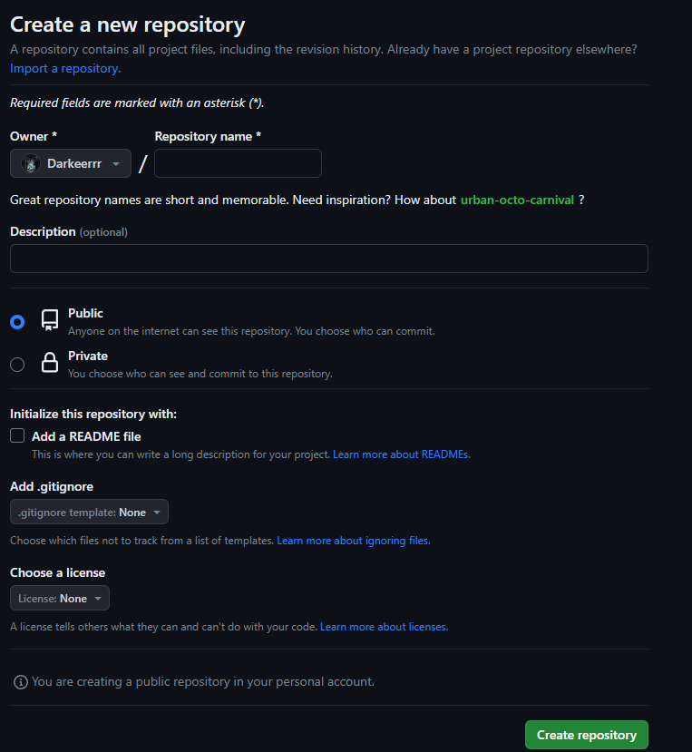

# ***Работа с удалённым репозиторием***
## 1. Создать аккаунт на GitHub
Для создания аккаунта на git hub перейдём на оффициальный сайт [GitHub](https://github.com) и создадим новый аккаунт.
## 2. Создать локальный репозиторий
Для создания локального репозитория достаточно создайть файл на компьютере и инициализировать его с помощью git
```
git init
```
а после проводить работу с локальным репозиторием
## 3. Создать удалённый репозиторий
После создания аккаунта в верхнем правом углу экрана нажимаем на плюсик для создания нового репозитория.

## 4. Связать удалённый репозиторий с локальным
Для связи удалённого репозитория с локальным репозиторием, воспользуемся 